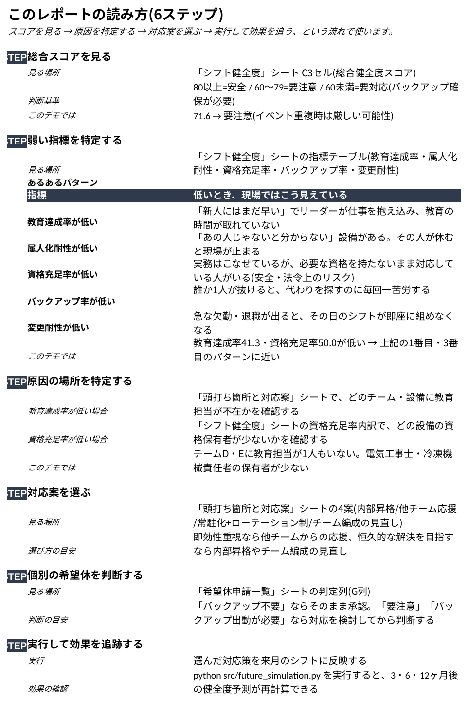

# A2E Works - Shift Improvement Support System

> 既存のExcelシフトを変えずに、教育・属人化・将来リスクを可視化するシステムです。
> 希望休の実現と教育計画の両立を後押しし、管理者がより良い判断をできるよう
> 支援します(架空データによるデモ/V1)。

このシステムでできることは、大きく2つです。

1. **教育・指標改善を目的にした逆算型のシフト計画**: 3・6・12ヶ月後に健全度がどうなるかを
   予測しながら、今月どこに教育投資枠(早番A)を使うべきかを判断できる(STEP5・STEP7)
2. **スマホでの希望休申請+条件を満たせば自動承認**: メンバーはスマホから希望休を申請し、
   管理者があらかじめ決めた条件(申請期限・週40時間・必要人数・NGペア)を満たせば、
   承認作業なしでその場で通る(STEP6追加2)


**まずはこれだけ見てください →** 下のリンクをクリックしてください:
[excel/A2EWorks_シフト健全度レポート_2026年8月.xlsx](excel/A2EWorks_シフト健全度レポート_2026年8月.xlsx)
上のスコアがどう計算され、希望休の承認判断や教育の優先順位づけにどう使えるかが一通りわかります。

<details>
<summary>ファイルの開き方(クリックで表示)</summary>

1. すぐ上にある青いリンク([excel/A2EWorks_シフト健全度レポート_2026年8月.xlsx](excel/A2EWorks_シフト健全度レポート_2026年8月.xlsx))をクリックする。GitHub上でファイルの中身が表示される
2. 画面右上あたりにあるダウンロードボタン(↓のアイコン、「Download raw file」)をクリックしてパソコンに保存する
3. 保存したファイルをダブルクリックして開く
   - Excelがあれば、そのまま開けます
   - Excelがない場合は、以下の無料の方法でも開けます
     - **Googleスプレッドシート**: Googleドライブにファイルをアップロード→右クリック→「アプリで開く」→「Googleスプレッドシート」
     - **LibreOffice Calc**: [libreoffice.org](https://www.libreoffice.org/)から無料でダウンロードできる表計算ソフト
4. 開いたら、まず一番左の「使い方」タブをクリックしてください

</details>

📩 自社のExcelでも試してみたい方は、ページ末尾の[お問い合わせ](#お問い合わせ)からどうぞ。

---

## もっと詳しく見る方法

STEP0〜STEP8まですべて完了済みです。以下の3通りの見方があります。

### 1. Excelレポート(一番わかりやすい・管理者向け)
[excel/A2EWorks_シフト健全度レポート_2026年8月.xlsx](excel/A2EWorks_シフト健全度レポート_2026年8月.xlsx) を開いてください。
最初の「使い方」シートに、スコアを見てから改善アクションに落とし込むまでの
6ステップの読み方ガイドが入っています(「あ、これウチだ」と思ってもらえる
現場あるあるパターンと、指標ごとの数値の目安付き)。管理者向けのSTEP1〜6に加えて、
メンバー向けにスマホでの健全度確認〜希望休申請の手順(STEP0)も載せています。

**使い方シート**(読み方6ステップ+よくあるパターン)


**シフト表シート**(氏名×日付、早A/早B/夜/明/休を色分け)


**頭打ち箇所シート**(教育担当が不在で、これ以上教育が進まない箇所の診断)


| シート | 内容 |
|---|---|
| 使い方 | スコアの読み方から改善アクションまでの6ステップガイド |
| シフト健全度 | 総合スコア(71.6/100)+5指標+判定(安全/要注意/要対応) |
| シフト表(2026年8月) | 氏名×日付の一般的なExcelシフト表(早A/早B/夜/明/休) |
| 希望休申請一覧 | 各希望休について、承認した場合の判定(バックアップ要否)+自動承認可否 |
| 労働時間・自動承認設定 | 週40時間チェック(健全度と無関係の法令チェック)+自動承認の設定・条件+関連法令メモ |
| 頭打ち箇所 | 教育担当が不足していて、これ以上教育が進まない箇所の診断結果 |
| メンバーデータ | すべての数式のソースとなる生データ |

### 2. ダッシュボード(スマホ想定・双方向プロトタイプ)

**タップするだけで開けます(ダウンロード不要) →**
**https://a2e-works.github.io/Shift_Generate_Demo/dashboard/index.html**

スマホ・PCどちらのブラウザでも動作します。特別なアカウントやアプリのインストールは不要です。

- **メンバービュー**: 現在の組織全体の健全度を確認したうえで、自分のシフトを確認し、希望休を申請
- **管理者ビュー**: 健全度・希望休の承認/却下・未来予測・頭打ち箇所の診断・自動承認機能のON/OFF切り替え

データはブラウザのlocalStorage(この端末・このブラウザ内だけの保存領域)に保存されるため、
他の人とはリアルタイムには共有されません。「サーバー無しでも申請〜承認のやり取りが
その場で動く」ことを1人で試すためのデモです。

<details>
<summary>上のリンクが開けない場合(クリックで表示)</summary>

[dashboard/index.html](dashboard/index.html) をダウンロードして、ダブルクリックでブラウザで
開くこともできます(初回読み込み時のみ、デザイン用ライブラリの読み込みにインターネット接続が必要です)。

1. すぐ上にある青いリンク([dashboard/index.html](dashboard/index.html))をクリックする。GitHub上でファイルの中身が表示される
2. 画面右上あたりのダウンロードボタン(↓のアイコン、「Download raw file」)をクリックしてパソコンに保存する
3. 保存したファイルをダブルクリックする(自動的にブラウザで開きます)

</details>

(`dashboard/ShiftDashboard.jsx` は同じ内容のReactコンポーネント版です。Claudeのアーティファクト機能
など、Reactを実行できる環境をお持ちの方はこちらもご利用いただけますが、通常は上記のHTML版で十分です。)

### 3. Pythonで裏側のロジックを直接動かす
```bash
pip install -r requirements.txt
python src/health_score.py       # シフト健全度を計算
python src/future_simulation.py  # 未来予測・頭打ち検出・退職シミュレーション
python src/auto_approval.py     # 週40時間チェック・希望休の自動承認判定
```
(他のコマンドは「実行方法」セクションを参照)

> 💡 ここまで見て「自社のExcel運用でも同じことができそう」と思われたら、
> このまま[お問い合わせ](#お問い合わせ)へどうぞ。

---

## これは何か

**「シフトを自動生成するシステム」ではありません。**

既存のExcelシフト・既存のシフト管理運用をそのまま活かしながら、
教育・属人化・将来リスクを可視化する**シフト改善支援システム**です。
希望休の実現と教育計画の両立を後押しし、管理者や決裁者がより良い判断をできるよう支援します。

> 現場を変えない。Excelを変えない。現場のノウハウを活かしたまま改善する。

## なぜ作るのか

24時間365日稼働のIT運用現場でのシフト管理経験から生まれたプロジェクトです。

- 希望休が出るとシフト全体が崩れる
- 教育が後回しになり、属人化が進む
- 経験の浅い人でも人手不足でリーダーにせざるを得ない
- 管理者は将来困ることを分かっていても、目の前のシフトを作るだけで手一杯

これをExcel運用を変えずに改善することを目指します。

## 設計原則

1. 既存のExcel・既存シフト運用を置き換えない。
2. シフトを作ることより、現場を改善することを目的とする。
3. 教育を義務ではなく、組織全体の柔軟性を高める投資として扱う。
4. 個人を評価するのではなく、組織全体の健全性を可視化する。
5. 数値は管理のためではなく、管理者・決裁者の意思決定を支援するために用いる。

## V1デモ現場設定

架空の「24時間365日稼働 設備保全センター」(15名 / 3名×5チーム)を題材にします。
介護・IT運用・製造など他業種にも応用可能な構造です。

シフトパターン: 早番A(未来への投資枠) / 早番B / 夜勤 / 明け / 休み

## 開発ステップ

- [x] STEP0 設計思想
- [x] STEP1 メンバー15名の属性設計
- [x] STEP2 教育ロードマップ設計
- [x] STEP3 制約条件設計
- [x] STEP4 シフト健全度計算設計
- [x] STEP5 仮想シフト作成
- [x] STEP6 ダッシュボード
- [x] STEP7 未来シミュレーション
- [x] STEP8 README・GitHub公開(仕上げ)

## ディレクトリ構成

```
a2e-works/
├── README.md
├── requirements.txt
├── data/
│   ├── members.json             # STEP1: メンバー15名のマスタデータ(実績回数含む)
│   ├── education_roadmap.json   # STEP2: 設備別の教育ロードマップ(段階と昇格条件)
│   ├── constraints.json         # STEP3: 制約条件(資格要件・NG/推奨ペア・夜勤上限・希望休・長期休暇)
│   └── shift_schedule.json      # STEP5: 2026年8月分の仮想シフト(5チームローテーション)
├── src/
│   ├── members.py                # STEP1: メンバーのデータモデル(dataclass)と読み込みロジック
│   ├── education.py               # STEP2: 昇格条件の判定ロジック(誰が次段階に近いか)
│   ├── constraints.py             # STEP3: 制約条件のチェックロジック(資格ギャップ・NG/推奨ペア等)
│   ├── health_score.py            # STEP4: シフト健全度スコアの算出ロジック
│   ├── shift_schedule.py          # STEP5: 仮想シフト生成+希望休/夜勤上限/NGペアとの衝突検出
│   └── future_simulation.py       # STEP7: 未来シミュレーション(頭打ち検出・増員案・退職リスク判定)
├── scripts/
│   └── generate_demo_experience_counts.py  # デモ用の実績回数を自動生成するツール
├── dashboard/
│   ├── index.html                 # STEP6: 単体HTML版ダッシュボード(ブラウザで直接開ける、推奨)
│   └── ShiftDashboard.jsx         # STEP6: 同内容のReactコンポーネント版
└── excel/
    ├── generate_excel_report.py   # 管理者向けExcel(シフト表+シフト健全度)の生成スクリプト
    └── A2EWorks_シフト健全度レポート_2026年8月.xlsx  # 生成されたExcelレポート本体
```

## 実行方法

```bash
pip install -r requirements.txt
python src/members.py       # メンバー構成のサマリを表示
python src/education.py     # 昇格条件クリア状況・育成中メンバーの一覧を表示
python src/constraints.py   # 資格充足ギャップ・NG/推奨ペア・希望休の一覧を表示
python src/health_score.py  # シフト健全度スコア(総合+内訳)を表示
python src/shift_schedule.py  # 1か月分の仮想シフト生成+衝突検出を表示
python excel/generate_excel_report.py  # 管理者向けExcelレポートを生成
python src/future_simulation.py  # 3/6/12ヶ月後の予測・頭打ち検出・退職シミュレーションを表示
python src/auto_approval.py       # 週40時間チェック・希望休の自動承認判定を表示
```

`dashboard/index.html` はダブルクリックしてブラウザで開くだけで、メンバー/管理者
それぞれの画面として動作します(特別な環境・インストール不要)。
`dashboard/ShiftDashboard.jsx` は同内容のReactコンポーネント版です。

`excel/generate_excel_report.py` が出力するExcelは、氏名を左列・日付を横に並べた
従来のシフト表形式に「シフト健全度」を数式で組み込んだもの。健全度・資格充足率などは
すべてExcelの数式(COUNTIF/SUMPRODUCT/INDEX/MATCH等)で計算されるため、
メンバーデータ(資格・スキル段階)を更新すればスコアも自動的に再計算される
(管理者への提示にはExcel形式が望ましいという要望に対応)。

## STEP2: 教育ロードマップの考え方

教育は「見学→補助→単独→教育担当補助→教育担当」の5段階で進む。
各設備(受変電設備・空調設備・消防設備・監視盤)ごとに、段階を進むための条件を
`data/education_roadmap.json` に定義している。条件は「経験日数」ではなく
**経験回数**(例: 停電試験2回、法定点検3回)と、必要に応じて経験月数の下限。

`src/education.py` はこの条件とメンバーの実績を突き合わせ、
- 誰がもう昇格条件をクリアしているか
- 誰が育成中で、あと何が足りないか

を機械的に可視化する。これは自動昇格の判断ではなく、
**管理者が教育計画を立てるための材料**として位置づける。

## STEP3: 制約条件の考え方

制約(資格必須・NGペア・推奨ペア・夜勤回数・希望休・長期休暇・労働時間)を
`data/constraints.json` にデータ化し、`src/constraints.py` で以下をチェックできるようにした。

- **資格充足ギャップ検出**: 「単独対応以上のスキルを持つのに必要資格を保有していない」メンバーを自動抽出
- **NGペア/推奨ペア判定**: 同時配置を避けるべき組み合わせ、教育目的で組みたい組み合わせの判定
- **夜勤回数上限チェック**: 役職ごとの月間夜勤上限に対する判定
- **希望休/長期休暇判定**: 特定の日付がそのメンバーの希望休・長期休暇にあたるかの判定

これらはシフトを自動生成するためのソルバー制約ではなく、
**既存のExcelシフトや管理者の判断を後から検証・補助するためのチェック関数**として位置づける。

## STEP4: シフト健全度の考え方

「シフト健全度」を、STEP1〜3のデータから実際に計算する。
5つの指標(いずれも高いほど健全)を算出し、平均を総合スコアとする。

| 指標 | 計算方法 |
|---|---|
| 教育達成率 | 保有スキルが教育ロードマップ上どこまで進んでいるかの平均 |
| 属人化耐性 | 設備ごとに「単独対応以上」ができる人数(少なすぎる設備がないか) |
| 資格充足率 | 「単独対応以上」なのに必要資格を持っていない人の割合(STEP3のギャップ検出を利用) |
| バックアップ率 | バックアップ可能業務を1つ以上持つメンバーの割合 |
| 変更耐性 | チームごとに「誰か1人が急に休んでも回るか」をシミュレーション |

原則として「変更回数ではなく変更耐性を評価する」という考え方のもと、
変更耐性はシフト変更履歴の回数ではなく、**チームの構造的な余裕**として算出している。

デモデータでの現在値は総合スコア 71.6/100。教育達成率(41.2)と資格充足率(50.0)が
スコアを押し下げており、「教育を進めれば健全度が上がる」ことをそのまま示す
未来シミュレーション(STEP7)につながる状態になっている。

## STEP5: 仮想シフト作成の考え方

シフトモデル(早番A→早番B→夜勤→明け→休み、5チームが1日ずつ
ずれてローテーション)を、2026年8月分(31日間)のカレンダーとして実際に展開した。

**重要なのは、これは「最適なシフトを自動生成する」機能ではないという点。**
むしろ逆で、既存Excel運用にありがちな「単純に5チームローテーションを回すだけ」
という前提を再現し、それが希望休・夜勤回数上限・NGペアと衝突する箇所を
機械的に検出することで、"何もしなければどこで無理が生じるか"を可視化する。

デモ結果(抜粋):
- 希望休との衝突: 5件(例: 田中誠さんの希望休にも関わらず早番Aが割当済み)
- 夜勤回数の役職別上限オーバー: 3件(新人2名が月6回の夜勤で上限4回を超過など)

単純なローテーションだけでは新人に過度な夜勤負担がかかる、という
開発の出発点にあった課題が、そのまま数値で再現される結果になっている。

## STEP6: ダッシュボードの考え方

将来的な目標として、
「メンバーがスマホでシフトを確認し、希望休を申請し、管理者が承認すると
サーバー構築の手間なく即座に反映される」体験を、実際に動くプロトタイプとして検証した。

`dashboard/index.html` はブラウザのlocalStorageを使った単体HTMLファイルとして動作し、

- **メンバービュー**: 現在の組織全体の健全度を確認したうえで、自分のシフトをカレンダーで確認し、希望休を申請
  (カレンダーの各日には「この日に自分が休んだら交代なしで済むか、交代要員が見つかるか」を
  シミュレーションした休みやすさスコアを表示。早番Aは交代不要、早番B・夜勤は必要人数分の
  交代要員が実際に見つかるかまで判定する)
- **管理者ビュー**: シフト健全度スコア(STEP4)、実際に衝突している希望休だけの抽出、
  夜勤上限オーバー(STEP5)を確認しながら、その場で承認/却下

というやり取りを、サーバーを構築せず即時反映できることを実証した(同一ブラウザ内での動作確認用。
複数人でのリアルタイム共有には別途サーバーが必要)。

これは本番のスマホアプリそのものではない。認証・Excel連携は別途必要になる。また、
代替要員の「候補提案」まではSTEP6追加2で実装したが、提案した交代を実際のシフト表へ
書き込む・本人に通知するところまでは自動化していない(管理者が最終確認のうえ反映する想定)。
「この操作フローで運用が回るか」を検証するための土台として位置づける。

## STEP6追加: 管理者向けExcelレポート

管理者への提示は使い慣れたExcel形式が望ましいという想定のもと、
氏名を左列・日付を横に並べた従来のシフト表に「シフト健全度」を組み込んだ
Excelレポート(`excel/generate_excel_report.py`)を追加した。

- 健全度・資格充足率などはすべてExcelの数式で計算される(ハードコードしない)。
  教育を進めて資格を取得すれば、Excel上でそのままスコアが上がることを確認できる。
- 各希望休申請について、「承認した場合そのチームに単独対応できる人が何人残るか」を
  数式で判定し、80/60というスコア帯の考え方を個別の申請レベルに落とし込んだ:
  残り2人以上「バックアップ不要」、1人「要注意」、0人「バックアップ出動が必要」。
- 「頭打ち箇所」シートでは、教育担当が不在でこれ以上教育が進まない箇所を一覧化している
  (STEP7と同じロジック)。具体的にどう改善すべきかの提案ロジックは`src/future_simulation.py`
  に実装済みだが、公開デモ上では診断結果のみを表示している。
- これは「教育を進めれば希望休が通りやすくなる」ことをメンバー自身にも実感してもらい、
  今月のシフト・教育投資(早番A)の使い方が3〜6ヶ月後の健全度に直結するという
  意思決定を後押しするための土台(STEP7の未来シミュレーションに接続する)。

## STEP6追加2: 希望休の自動承認・交代要員の提案・週40時間チェック

「健全度への影響が小さく、当事者間の調整も不要な希望休は、管理者の承認なしで
通せるようにしたい。ただし申請期限は設ける。管理者はこの機能自体をON/OFFできる」
という要件に対応した(`src/auto_approval.py`)。

**早番Aと早番B・夜勤の扱いの違い**

チーム制のため、早番B・夜勤(通常の運行シフト)で休みが入ると、本来はチーム全員(3名)で
運行する前提が崩れ、他チームからの交代が必要になる。一方、早番A(教育投資枠)は
通常の運行に必須の枠ではないため、誰が休んでも運行上の穴は生じない。この違いを
`src/substitution.py`でモデル化した:

- **早番B・夜勤**: 必要人数はチーム定員と同じ3名。1名でも欠けると、その日「休み」または
  「明け」で元々空いている他チームのメンバーから交代候補を探す(NGペアが絡まない人を優先)。
  交代要員が見つかれば「◯◯ → ◯◯(チーム◯)」という形で提示される。見つからない場合は
  手動確認に回る。
- **早番A**: 必要人数の定めなし。誰が休んでも交代なしで承認可能。

**自動承認の条件(すべて満たした場合のみ、承認なしで通る)**

1. 自動承認機能が有効になっている(管理者設定、ダッシュボードのトグルでON/OFF可能)
2. 申請日から希望日まで、設定した日数(デモでは14日)以上ある
3. その週にチーム内で週40時間超えが無い(次項、健全度に関係なくブロックする。早番Aは対象外)
4. 必要人数を満たせる(交代不要、または交代要員が実際に見つかる。早番Aは対象外)
5. NGペアの相手が関わる、当事者間の調整が必要な状況ではない

いずれか1つでも満たさない場合は、通常どおり管理者の手動承認に回る
(「希望休申請一覧」シートの自動承認可否列・交代要員の提案列、ダッシュボードの
申請状況にそれぞれ理由が表示される)。ダッシュボードのカレンダーに表示される
「休みやすさスコア」も、この交代シミュレーションの結果に連動している
(早番A・交代不要=95、交代要員あり=85、交代要員なし=必要人数に対する充足率)。

**週40時間チェック(健全度とは無関係の法令チェック)**

週40時間を超える勤務は、シフト健全度が高くても法令上の問題が残るため、独立してチェックする。
デモでは「早番A/早番B=8時間、夜勤=16時間」という単純な前提で計算しており、この前提だと
複数チームで恒常的に週40時間を超える結果になった。実際の24時間現場では、夜勤を含むシフトは
「1ヶ月単位の変形労働時間制」等で運用され、週単位ではなく月単位で平均をとるのが一般的なため、
本チェックはあくまで簡易チェックと位置づけ、以下の関連法令メモをExcel(「労働時間・自動承認設定」
シート)に明記した。

- 36協定(原則): 月45時間までの残業は毎月可能(年360時間以内)
- 36協定(特別条項): 月45時間を「超える」残業ができるのが年6回まで
- 1日8時間超のシフト: 「変形労働時間制」を導入していれば、所定労働時間として8時間超の設定が可能
- 日付またぎの勤務: 暦日に関わらず「1つの勤務」として計算される。休憩(8時間超で1時間以上)と
  割増賃金を支払えば16時間拘束も可能

実際の適法性判断には社会保険労務士等への確認を推奨する、という注記も添えている。

## STEP7: 未来シミュレーションの考え方

「教育すれば健全度が上がる」を、単なる右肩上がりの楽観的グラフではなく、
**教育担当が同乗している早番Aでしか教育は進まない**という現実的な前提でシミュレーションした。
これにより、放っておくと健全度がどこかで頭打ちになること、そしてそれを解消するために
具体的に何が必要かを示せるようにした。

- **3/6/12ヶ月後の予測**: 現ペースだと総合スコアは71.6→72.2→73.0→73.0(6ヶ月以降は頭打ち)
- **頭打ちの原因の特定**: 教育担当が1人もいない(チーム, 設備)の組み合わせを検出
  (デモデータでは13組み合わせ。特にチームD・Eは全設備で教育担当が不在)
- **「あと何人必要か」の提示**: 13という数字は「チーム×設備」の不足組み合わせ数であり、
  そのまま必要人数ではない。1人が同じチーム内の複数設備をまとめて担当できるため、
  実際に昇格させるべき人数を数え直すと**5人**(チームごとに最もスキルの高い1名)で
  13件すべて解消できる
- **増員した場合のwhat-if**: 候補者を教育担当に昇格させた場合、理論上限が
  総合73.0→79.6、教育達成率56.7%→100%まで伸びることを試算
- **頭打ち箇所ごとの対応案**: 「人が足りません」で終わらせず、複数の改善案(内部昇格・
  他チームからの応援・常駐化+ローテーション制・チーム編成の見直し等)を比較提示する
  ロジックを`src/future_simulation.py`に実装済み。公開デモのExcel・ダッシュボードでは
  「どこが頭打ちか」という診断結果のみを表示し、具体的な改善案の中身は個別相談時に提示する構成にしている。
- **退職シミュレーション**: 役職ごとに後任育成に必要なリードタイムが異なるという前提
  (リーダー6ヶ月・サブリーダー3ヶ月・それ以外1ヶ月)のもと、「いつ・どの役職が
  抜けると危険か」、後継候補が社内にいるかを判定する

## 指標の3層構造(運営余力・シフト健全度・将来健全度)

シフト健全度の5指標に加えて、「そもそも工夫する以前に、物理的な体制が足りているか」を見る
**運営余力指数**を導入した。ただし、これを常時表示する6つ目の指標としては追加していない。
理由は、現状の(架空)デモデータは常に必要人数・必須資格保有者が足りている状態のため、
この指標は普段は100点のまま変化せず、常時表示すると情報量がないまま画面が複雑になるだけになる。

そこで、運営余力指数が本当に意味を持つ「変化が起きる場面」、つまり退職シミュレーションに
組み込んだ(`src/future_simulation.py`の`calc_operating_capacity_index`/`succession_risk`)。
「チームCのリーダーが辞める」というシナリオでは、運営余力指数が100.0→95.8に低下する、
というように、抜ける前後の比較として表示される。

これにより、指標全体は以下の3層構造になっている(経営者にも現場にも意図が伝わりやすい並び):

1. **運営余力指数**: 物理的に回せるか(頭数・必須資格保有者の存在。退職シミュレーションで使用)
2. **シフト健全度**: 健全に回せるか(既存の5指標。常時表示)
3. **将来健全度**: 将来も回せるか(3/6/12ヶ月後の予測。STEP7で常時表示)

前提・簡略化(すべてコード内に明記): 早番Aは1チーム月6回と近似、進捗は各遷移の
主要カウントのみで判定(停電試験等の副条件は達成可能とみなし対象外)、資格取得・
バックアップ可否は本シミュレーションでは変化しないものとする。

このロジックは `excel/generate_excel_report.py` の「頭打ち箇所」シートにも反映しており、
13件の不足箇所の一覧をExcel上で確認できる(改善案そのものは非公開)。

## 現時点の制約(V1の範囲)

- データはすべて架空のデモデータ(15名/設備保全センター)。実在の組織データとの連携は未実装。
- `dashboard/index.html` はブラウザのlocalStorageで動くプロトタイプであり、
  複数人・複数端末でのリアルタイム共有、認証、通知機能などは持たない。
- 希望休の承認後、交代要員の**候補提案**まではSTEP6追加2で実装済み(早番B・夜勤で必要人数を
  割り込む場合、他チームの空いている人から自動で候補を探す)。ただし、その交代を実際の
  シフト表へ書き込む・本人に通知するところまでは自動化していない(管理者が最終確認のうえ反映)。
- 未来シミュレーション(STEP7)は「教育担当同乗の早番Aのみ進捗」という単純化したモデルであり、
  実際の停電試験・法定点検の発生頻度などは考慮していない。

## V2以降の構想

人員不足時に「人が足りません」で終わらせず、複数案(リーダーのみ変則シフト/教育延期/
応援依頼/採用/残業増)を提示し、それぞれのシフト健全度・教育への影響・属人化・コスト・
残業時間を比較して管理者が選べるようにする、という構想。今回追加した
「頭打ち箇所の診断ロジック」はその最初の実装例にあたる(具体的な対応案の提示は個別相談ベース)。

## お問い合わせ

このリポジトリを見て「自社のExcelシフト表でも試してみたい」「カスタマイズを相談したい」
と思っていただけた方は、下記よりお気軽にご連絡ください。

> **現在(2026年8月2週目まで)、新規のご相談対応は一時停止しております。**
> 8月2週目以降、順次対応可能になります。
>
> その間は、このリポジトリを **⭐ Star** / **👀 Watch** しておいていただくと、
> 対応再開のタイミングや今後の機能追加(V2構想など)にすぐ気づけます。

[クラウドワークス プロフィール](https://crowdworks.jp/public/employees/6117026)
